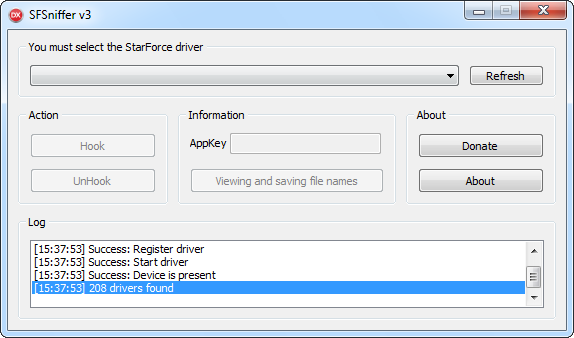
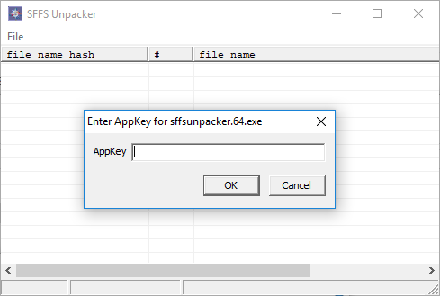
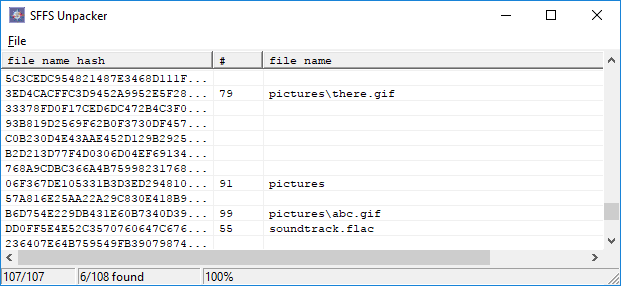

# SFFS-Unpacker
This is unpacker for Starforce SFFS containers.

> Don't be too thrilled. To unpack data you need to know APPKEY and file names in container.

## Enter APPKEY

AppKey is 8-byte key used for decryption, like ``15ABA4F251A75DBA``.

Catch it with **SFSniffer** created by **MasterSoft**.

> Your system must be able to run 32-bit driver (SFSniffer.sys)

Now run **SFFSUnpacker** and drag'n'drop resource file
(usually it is **resource0.dat**)

It will ask you to enter AppKey.

If key is incorrect you'll get error message **Failed to load SFFS header**.

If it's fine, you'll see list of file name hashes.

> If you've saved project before, then AppKey, hashes and file names
> will be loaded automatically from project.

## Enter File Names

Use sniffer mentioned above to catch file names.
Without file names you can't unpack file.

Once you get some file names 
- hit **F5** or go to **File\Add file names...**
- Enter list of file names.
- Press **Add**.
- File names will be verified by hash.
- All correct names (matched by hash) will be added.
- All incorrect names will stay in input window.
- Close input window when you're done.

You'll get something like this

> "pictures" (91) in example is actually directory and is not really needed

## Unpacking

- To unpack a file double click it.
- To unpack all available files hit **F9** or **File\Extract All**.

Files will be extracted to new **sffs_out** folder and it will
be opened in explorer after unpacking.

## Donate

- Unpacker by **VDisAsm**:   ``1FFxwXUyAXeFqBFAqjMJMLMZ9N9fRrK9jc``
- Sniffer by **MasterSoft**: ``1Aba6BfTcobqwrmeoVoZkmruk7JXS8bPp6``